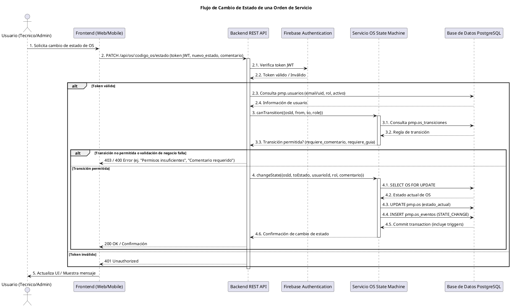
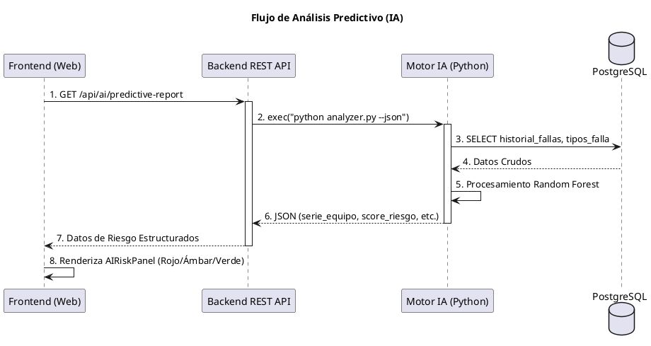

# 6. Flujos de Datos Clave

Este documento describe los flujos de información más críticos dentro del Sistema PMP Suite, ilustrando la interacción entre los diferentes componentes del sistema. Se utilizarán descripciones narrativas y prompts para diagramas de secuencia.

## Descripción

El sistema PMP Suite maneja varios flujos de datos importantes, desde la autenticación del usuario hasta el complejo ciclo de vida de una Orden de Servicio (OS) y la interacción con el módulo de Inteligencia Artificial. A continuación, se detallan los flujos clave.

### 6.1. Flujo de Autenticación de Usuario

Este flujo describe cómo un usuario inicia sesión en el sistema y cómo su identidad y rol son verificados a través de los diferentes componentes.

1.  **Inicio de sesión (Frontend Web/Móvil):** El usuario introduce sus credenciales (email/password) en la interfaz del frontend.
2.  **Autenticación (Firebase Client SDK):** El frontend envía las credenciales al SDK de Firebase Client. Firebase autentica al usuario y devuelve un Firebase ID Token.
3.  **Configuración del Token (Frontend):** El frontend almacena el Firebase ID Token (idealmente de forma segura: HttpOnly cookies / Keychains) y lo configura en el cliente Axios para futuras solicitudes.
4.  **Verificación de Rol (Backend API):** Para acceder a rutas protegidas, el frontend envía el Firebase ID Token en el encabezado `Authorization`. El Backend REST API lo intercepta, lo verifica con Firebase Admin SDK y consulta la base de datos PostgreSQL (`pmp.usuarios`) para obtener el rol y el estado de actividad del usuario.
5.  **Autorización (Backend API):** Si el token es válido y el usuario está activo y autorizado por su rol, el backend permite el acceso a la funcionalidad solicitada.
6.  **Información de Usuario (Frontend):** El frontend recibe la respuesta del backend, que incluye la información del usuario y su rol, y la utiliza para personalizar la interfaz.

### 6.2. Flujo de Cambio de Estado de una Orden de Servicio (OS)

Este flujo es central para la lógica de negocio del sistema, involucrando múltiples capas y la validación de roles.

1.  **Solicitud de Cambio de Estado (Frontend Web/Móvil):** Un usuario (ej. Técnico de Laboratorio) selecciona una OS y solicita un cambio de estado a través de la interfaz.
2.  **Llamada a Backend API:** El frontend envía una solicitud HTTP al Backend REST API (ej. `PATCH /api/os/:codigo_os/estado`) con el nuevo estado y, si es necesario, un comentario.
3.  **Autenticación y Autorización (Backend API):** Los middlewares del backend (`firebaseAuth`, `ensureUser`, `requireRole`) autentican al usuario y verifican si tiene el rol necesario para realizar la transición de estado.
4.  **Validación de Transición (Servicio OS State Machine):** El servicio `osStateMachine.js` en el backend consulta la tabla `pmp.os_transiciones` en PostgreSQL para verificar si la transición desde el `estado_actual` al `nuevo_estado` es permitida para el `rol_requerido` del usuario.
5.  **Validación de Comentario/Guía (Servicio OS State Machine):** Si la regla de transición lo requiere, el servicio valida la presencia de un comentario o un `guia_id`.
6.  **Validación de Ubicación (Trigger PostgreSQL):** Un trigger (`trg_validar_ubicacion_estado`) en PostgreSQL verifica que la nueva ubicación (si aplica) sea consistente con el nuevo estado de la OS.
7.  **Actualización de OS (PostgreSQL Transaction):** Si todas las validaciones pasan, el backend actualiza el `estado_actual` de la OS en `pmp.ordenes_servicio` e inserta un registro en `pmp.os_eventos` dentro de una transacción atómica.
8.  **Respuesta (Backend API):** El backend devuelve una confirmación al frontend.
9.  **Actualización de UI (Frontend):** El frontend actualiza la interfaz de usuario para reflejar el nuevo estado de la OS.

### 6.3. Flujo de Análisis Predictivo (IA)

Este flujo describe cómo el sistema utiliza los modelos de Machine Learning para predecir fallas y riesgos.

1.  **Solicitud de Análisis (Dashboard/Admin):** El frontend solicita el reporte de riesgo predictivo al Backend REST API.
2.  **Orquestación de Análisis (Backend API):** El backend, mediante un `Child Process`, ejecuta de forma asincrónica el motor de inferencia en Python (`analyzer.py`).
3.  **Ingesta de Datos Históricos (Módulo IA):** El script de Python se conecta directamente a PostgreSQL (Psycopg2) para extraer el historial de órdenes de servicio, tipos de falla y frecuencia de reincidencia por serie de equipo.
4.  **Procesamiento y Score (Scikit-Learn):** El motor aplica un modelo de **Bosque Aleatorio (Random Forest)** para calcular el `score_riesgo` basado en factores ponderados (ponderación de fallas EMV, MTBF histórico, etc.).
5.  **Retorno de Resultados (JSON):** El proceso de Python retorna un JSON estructurado con el TOP 10 de equipos en riesgo.
6.  **Visualización de Riesgo (UI Dashboard):** El frontend recibe los datos y los representa mediante el componente `AIRiskPanel` (Semáforo de Riesgo).

## Diagramas de Secuencia (Prompts)

### 6.2.1. Diagrama de Secuencia: Cambio de Estado de OS

Aquí tienes un prompt para generar un Diagrama de Secuencia utilizando PlantUML. Puedes copiar este código en una herramienta que soporte PlantUML para visualizar el diagrama.

### 6.3.1. Diagrama de Secuencia: Análisis Predictivo IA

---
