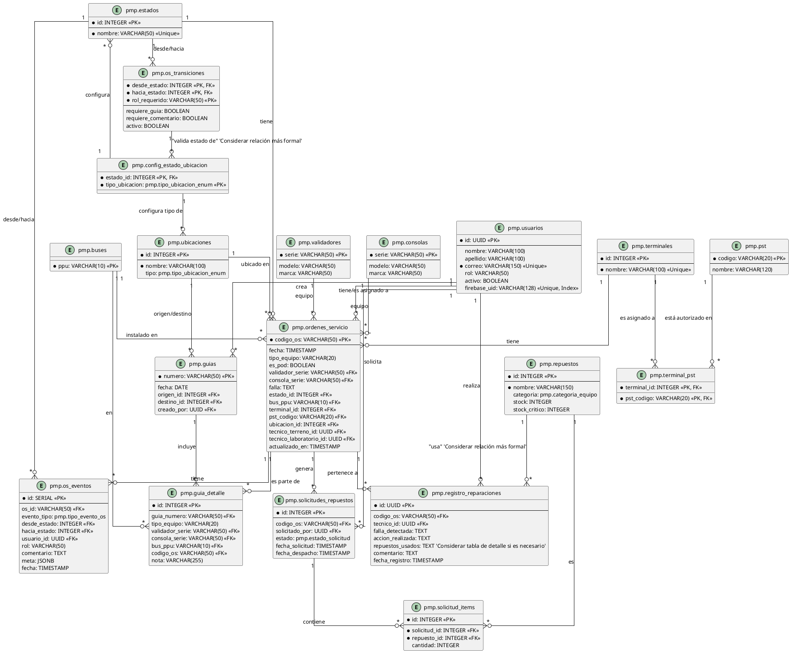

# 7. Diseño de Base de Datos (ERD)

Este documento describe el esquema de la base de datos PostgreSQL del Sistema PMP Suite, mostrando las tablas principales, sus atributos y las relaciones entre ellas. Se utiliza la notación para Diagramas Entidad-Relación (ERD).

## Descripción

La base de datos PostgreSQL es el repositorio central de toda la información transaccional y de configuración del sistema PMP Suite. Su diseño es relacional, con un esquema `pmp` que organiza las tablas principales, las cuales están interconectadas a través de claves primarias y foráneas para garantizar la integridad referencial. Se hace un uso extensivo de tipos `ENUM` para campos con valores discretos y triggers para hacer cumplir la lógica de negocio a nivel de base de datos.

## Entidades (Tablas) Clave

*   **pmp.usuarios:** Información de los usuarios del sistema, incluyendo rol y vínculo con Firebase UID.
*   **pmp.estados:** Catálogo de estados posibles para una Orden de Servicio.
*   **pmp.ubicaciones:** Catálogo de ubicaciones físicas (bodegas, laboratorios, QA).
*   **pmp.terminales:** Catálogo de terminales de equipos.
*   **pmp.pst:** Catálogo de códigos de operadores PST.
*   **pmp.terminal_pst:** Tabla de unión para la autorización de operadores PST en terminales.
*   **pmp.buses:** Catálogo de buses PPU.
*   **pmp.validadores:** Catálogo de validadores de equipos (series, modelos, marcas).
*   **pmp.consolas:** Catálogo de consolas de equipos (series, modelos, marcas).
*   **pmp.ordenes_servicio:** Tabla principal de Órdenes de Servicio (OS), con detalles del equipo, falla, estado, técnicos asignados y ubicación.
*   **pmp.os_eventos:** Historial de eventos y cambios para cada OS (cambios de estado, comentarios, alertas IA).
*   **pmp.os_transiciones:** Reglas que definen las transiciones de estado permitidas para las OS, por rol.
*   **pmp.config_estado_ubicacion:** Configuración de validación entre estados de OS y tipos de ubicación.
*   **pmp.registro_reparaciones:** Registros detallados de las reparaciones realizadas en una OS.
*   **pmp.repuestos:** Catálogo de repuestos con información de stock y categorías.
*   **pmp.solicitudes_repuestos:** Solicitudes de repuestos generadas por laboratorio.
*   **pmp.solicitud_items:** Detalle de los repuestos solicitados en cada `pmp.solicitudes_repuestos`.
*   **pmp.guias:** Registro de guías de despacho/recepción.
*   **pmp.guia_detalle:** Detalle de los equipos asociados a cada guía.

## Diagrama Entidad-Relación (ERD) (Prompt PlantUML)

Aquí tienes un prompt para generar un Diagrama Entidad-Relación utilizando PlantUML. Puedes copiar este código en una herramienta que soporte PlantUML para visualizar el diagrama. Debido a la complejidad y el número de tablas, este diagrama puede ser denso, pero representa todas las relaciones identificadas en `pmp_backup.sql`.

---

## 7.4. Fuente de Datos para el Módulo de IA

El Módulo de Mantenimiento Predictivo (v5.0) actúa como un consumidor analítico de solo lectura de las tablas transaccionales. Su lógica de inferencia se basa principalmente en:

1.  **pmp.ordenes_servicio:** Provee el historial base de fallas, permitiendo el cálculo de reincidencias por número de serie (`validador_serie` / `consola_serie`) y el tiempo medio entre fallas (MTBF).
2.  **pmp.os_eventos:** El campo `meta` (JSONB) es utilizado para análisis post-mortem de reparaciones complejas y para el entrenamiento del modelo de detección de anomalías ("Equipos Limón").
3.  **Análisis de Criticidad:** El modelo pondera tipos de falla específicos (ej: fallas EMV o de comunicación) para ajustar el `score_riesgo` que se muestra en los dashboards estratégicos.

---
