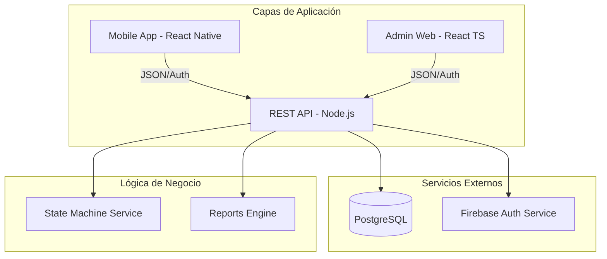

# Informe Técnico de Avance y Arquitectura - PMP Suite

## 1. Arquitectura del Sistema
El sistema utiliza una topología Cliente-Servidor desacoplada, facilitando el mantenimiento independiente de cada capa.

## 2. Estado de Implementación por Módulo

### 2.1 Backend (Núcleo) - 90%
- **Rutas de Gestión (CRUD)**: Completado al 100%.
- **Máquina de Estados**: Implementada. Faltan transiciones complejas de retorno (QA -> Lab).
- **Seguridad**: RBAC funcional con 5 niveles de acceso.

### 2.2 Frontend (Administración) - 85%
- **Dashboard**: 100% funcional con gráficos interactivos.
- **Bodega/Logística**: Nuevo módulo operativo. Permite flujo Terreno -> Bodega -> Laboratorio.
- **Laboratorio**: Cola de asignación operativa. Falta integración con sistema de tickets externos (vía API).

### 2.3 Mobile (Terreno) - 80%
- **Reporting de Fallas**: Listo. Incluye validadores de PPU y Series.
- **Multimedia**: Integración de cámara para evidencia de PODs operativa.
- **Offline Mode**: Pendiente de implementación (Roadmap v3.0).

---

## 3. Desafíos Técnicos Superados
- **Sincronización de Estados**: Se resolvió la discrepancia entre el Dashboard y la página de Asignación mediante la unificación de criterios basados en IDs numéricos de la base de datos, eliminando la dependencia de strings de texto.
- **Seguridad Cruzada**: Implementación de un flujo de autenticación donde el UID de Firebase se vincula de forma segura con el UUID interno de PostgreSQL a través del middleware `ensureUser`.

---

## 4. Análisis de Riesgos
- **Riesgo 1 (Conectividad)**: La App móvil depende de señal 4G para reportar. Mitigación: Implementar cola local (SQLite) en fase futura.
- **Riesgo 2 (Inconsistencia de Datos)**: Ingreso manual de series. Mitigación: Implementación de lector de código de barras (Roadmap).

---

## 5. Próximos Hitos
1. **Semana 1**: Integración de módulo de Despacho masivo (Laboratorio -> QA).
2. **Semana 2**: Reportes avanzados de rendimiento por técnico.
3. **Semana 3**: Pruebas de carga y optimización de índices en PostgreSQL.

---
**Documento generado por Antigravity AI Engine**
17 de marzo de 2026
